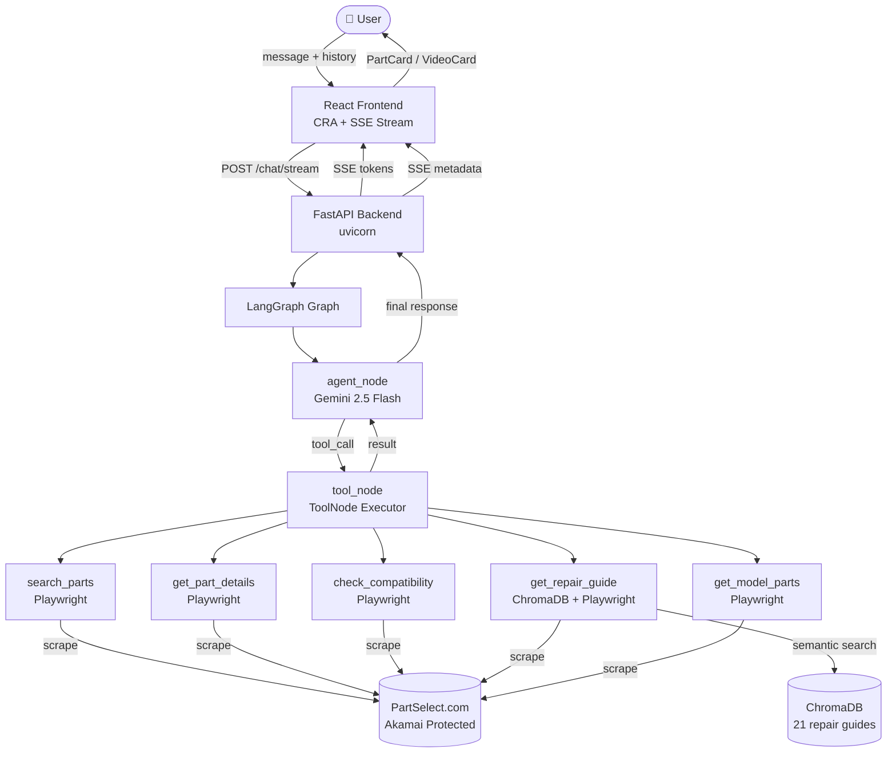
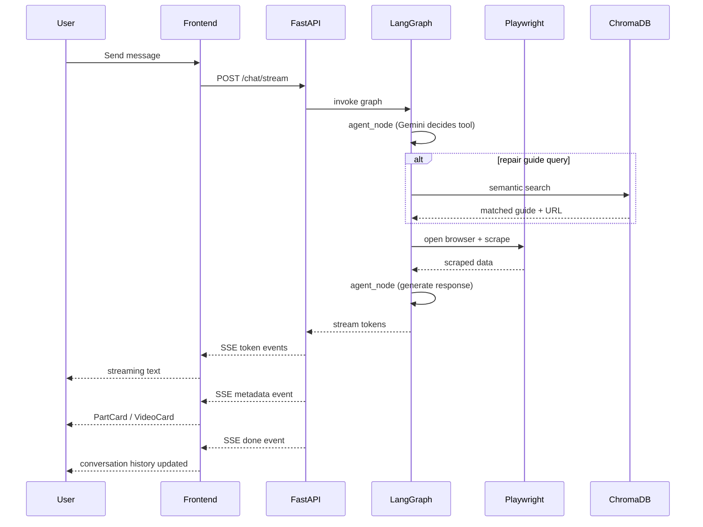

# PartSelect Chat Agent

An AI-powered customer service agent for finding refrigerator and dishwasher parts on PartSelect.com.

## Overview

The PartSelect Chat Agent is a conversational assistant that helps customers find appliance parts, check compatibility, get pricing and availability, and receive repair guidance — all scoped exclusively to refrigerators and dishwashers. It combines a LangGraph agent loop with live Playwright scraping of PartSelect.com to return real-time data rather than stale snapshots. The agent handles edge cases including harmful queries, prompt injection attempts, out-of-scope appliance types, and order support routing.

## Demo

### Welcome Screen


### Reponse Loading


### Part Details


### Repair Guide and Compatibility Check


## Architecture

### System Design



The agent runs as a two-node LangGraph graph that loops until the LLM has enough information to respond:

- **agent_node** — Gemini 2.5 Flash receives the full message history plus system prompt and decides which tool to call (or returns a final response if no tool is needed)
- **tool_node** — executes the chosen tool (Playwright scraper or ChromaDB lookup) and appends the result to the message list
- The loop continues, passing updated state back to `agent_node`, until the LLM emits a response with no tool call
- **State** is the full messages list; conversation history is maintained client-side and sent with every request, keeping the backend stateless

### Request Flow



### Tech Stack

| Component  | Technology |
|------------|------------|
| Backend    | FastAPI + Python 3.11 + uvicorn |
| Agent      | LangGraph + Gemini 2.5 Flash (langchain-google-genai) |
| Scraping   | Playwright (chromium) + playwright-stealth |
| Vector DB  | ChromaDB PersistentClient |
| Frontend   | React (CRA) + react-markdown + remark-gfm |
| Streaming  | SSE via FastAPI StreamingResponse |

### The 5 Tools

**1. search_parts**
Accepts a plain-language query and an appliance filter (`refrigerator` or `dishwasher`). Navigates to the PartSelect search results page with Playwright and scrapes the top results — part name, part number, price, and availability. The agent then selects the best match and calls `get_part_details` on it rather than showing raw search output.

**2. get_part_details**
Given a PS part number, scrapes the full product page: description, symptoms it fixes, installation difficulty and time estimate, price, availability, product image URL, and a repair video URL if one exists. This is the primary tool for answering "what is this part / how much does it cost / is it in stock" questions.

**3. check_compatibility**
Given a part number and a model number, navigates to the part's PartSelect page and searches the compatibility list for the model number string. Returns a boolean compatible flag plus the model name and URL. String matching is used because the PartSelect compatibility API returns 403 for unauthenticated requests.

**4. get_repair_guide**
First performs a ChromaDB semantic search over 21 pre-seeded repair guides to find the closest symptom match. If the distance score falls within the threshold (1.3), it navigates directly to that guide URL with Playwright and scrapes part recommendations and video links. If no close match is found, it falls back to a live PartSelect symptom search.

**5. get_model_parts**
Fetches the parts listing page for a specific model number. Accepts an optional `search_term` parameter — when provided, appends `?SearchTerm=` to the URL so PartSelect filters results server-side, making it practical to find a specific part type within a model's full catalog without being limited to the first 12 results.

### ChromaDB Vector Store

- 21 repair guides seeded: 12 refrigerator symptoms + 9 dishwasher symptoms
- Semantic matching maps colloquial descriptions to guide titles — e.g. "ice maker not working" → "Ice maker not making ice"
- Distance threshold of 1.3 gates whether a ChromaDB hit is close enough to use, falling back to live scraping if not

## Features

- Token-by-token SSE streaming with cycling loading messages during tool execution
- Rich PartCards with part image, price, availability, buy button, and video thumbnail
- VideoCards with YouTube thumbnails pulled from repair guides
- PartSelect branding — teal `#337778` and amber `#F5A623`
- Scope enforcement — refrigerators and dishwashers only; other appliance types are declined gracefully
- Edge case handling — harmful queries, prompt injection attempts, and off-topic questions each get a distinct, non-canned response
- Order support routing to PartSelect customer service (self-service URL, phone, and email)

## Setup & Running

### Prerequisites

- Python 3.11+
- Node.js 18+
- Google AI Studio API key

### Installation

1. Clone the repository
2. Install backend dependencies:
   ```bash
   cd backend
   pip install -r requirements.txt
   ```
3. Install Playwright browser:
   ```bash
   playwright install chromium
   ```
4. Create `backend/.env` and add your key:
   ```
   GOOGLE_API_KEY=your_key_here
   ```
5. Seed the ChromaDB vector store:
   ```bash
   python -m data.seed
   ```
6. Install frontend dependencies:
   ```bash
   cd ../frontend
   npm install
   ```

### Running

**Terminal 1 — backend:**
```bash
cd backend
uvicorn main:app --reload --port 8000
```

**Terminal 2 — frontend:**
```bash
cd frontend
npm start
```

Open [http://localhost:3000](http://localhost:3000)


## Key Technical Decisions

**1. Playwright over httpx**
PartSelect is protected by Akamai Bot Manager, which fingerprints TLS stacks, HTTP/2 headers, and JavaScript challenges. All non-browser HTTP clients (httpx, requests, curl) are blocked with 403 or redirect loops. Playwright with `playwright-stealth` passes these checks by running a real Chromium instance with realistic browser signals.

**2. PersistentClient over in-memory ChromaDB**
Using `chromadb.PersistentClient` writes the vector store to disk so seeded repair guides survive server restarts. An in-memory client would require re-seeding on every startup, adding latency and unnecessary embedding API calls.

**3. SSE over WebSockets**
Server-Sent Events are unidirectional (server → client), which is all streaming chat responses require. FastAPI's `StreamingResponse` supports SSE natively with no extra libraries or handshake overhead. WebSockets would add complexity with no practical benefit for this use case.

